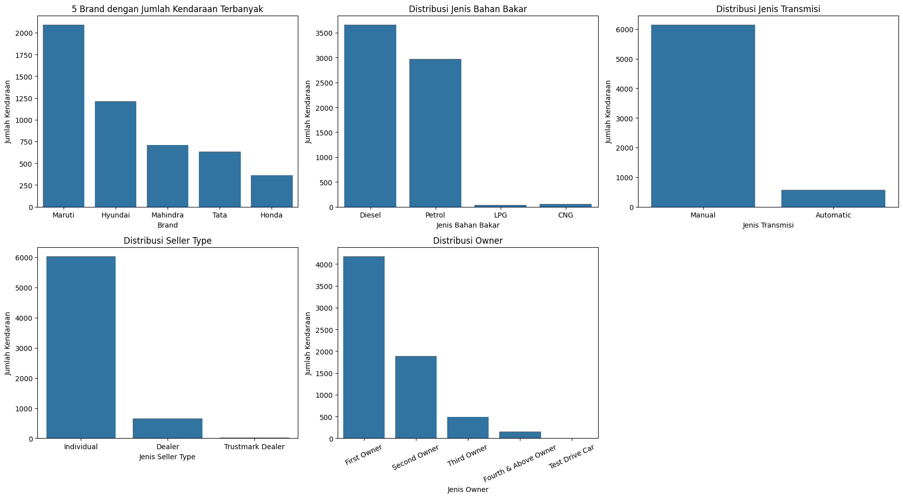
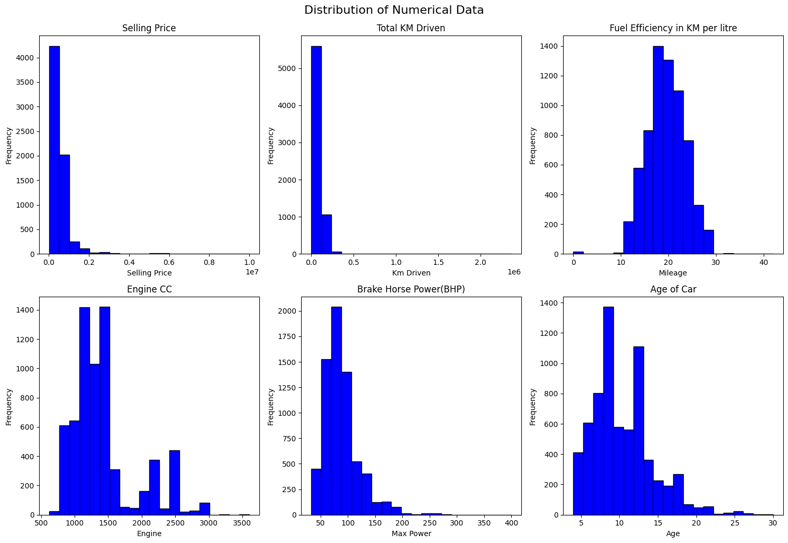
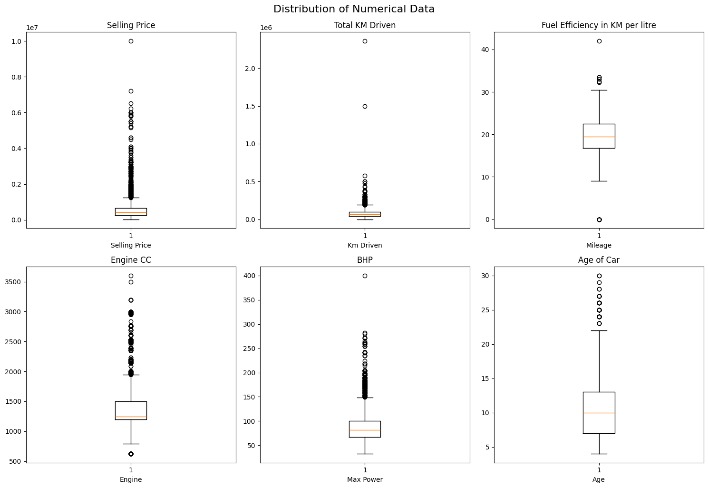
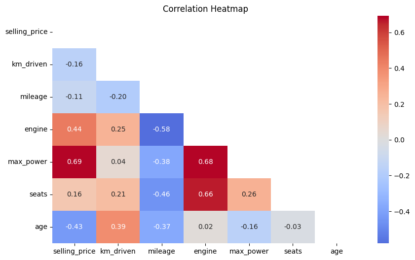
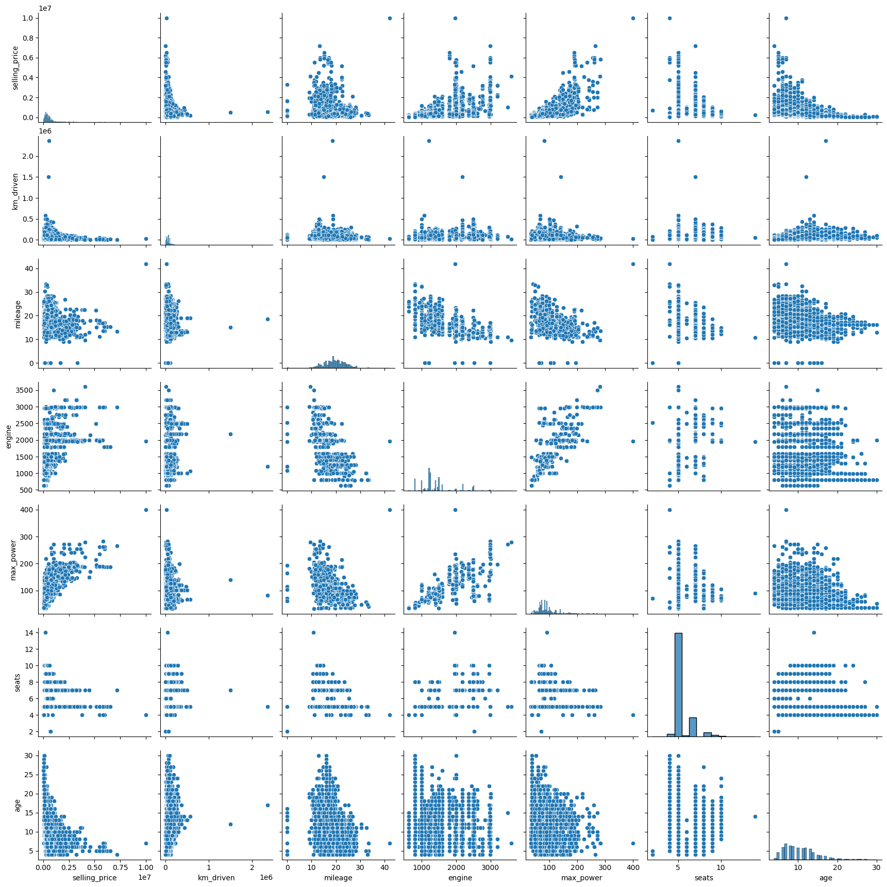
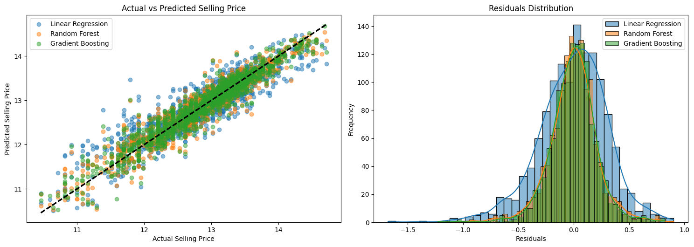

*Created: 17/08/2024*

[](/car-price-prediction/notebook.html)

---

# Car Price Prediction

<!--  -->


## Domain Proyek

### Latar Belakang:
Industri otomotif memiliki peran penting dalam ekonomi global [^1]. Salah satu tantangan terbesar yang dihadapi oleh industri ini adalah penentuan harga jual kendaraan. Dengan banyaknya faktor yang mempengaruhi harga kendaraan, seperti usia kendaraan, merek, jumlah kilometer yang telah ditempuh, jenis bahan bakar, dan banyak lagi, penting bagi penjual dan pembeli untuk memiliki alat yang dapat memprediksi harga jual dengan akurasi tinggi dan memperhatikan hasil evaluasi model [^2]. Penentuan harga yang tidak akurat dapat merugikan baik penjual maupun pembeli.

### Mengapa Masalah Ini Penting?
Memprediksi harga jual kendaraan dengan akurat memungkinkan pelaku industri otomotif untuk membuat keputusan yang lebih baik dan mengurangi kerugian finansial. Dengan menggunakan metode machine learning, kita dapat membangun model prediktif yang mampu memperkirakan harga jual berdasarkan fitur-fitur kendaraan yang relevan [^3] [^4].

## Business Understanding

### Problem Statements

1. Bagaimana model machine learning dapat digunakan untuk memprediksi harga jual kendaraan bekas berdasarkan fitur-fitur yang tersedia?
2. Fitur mana yang paling mempengaruhi harga jual kendaraan?
3. Algoritma mana yang memberikan hasil prediksi paling akurat atau lebih mendekati untuk kasus ini?

### Goals

1. Membuat model prediktif untuk memperkirakan harga jual kendaraan bekas.
2. Mengidentifikasi fitur-fitur yang paling mempengaruhi harga jual.
3. Membandingkan beberapa algoritma untuk menentukan model terbaik.

### Solution statements
1. Menggunakan Linear Regression, Random Forest Regressor, dan Gradient Boosting untuk membangun model prediktif.
2. Melakukan hyperparameter untuk meningkatkan kinerja model yang dihasilkan.
3. Mengevaluasi model berdasarkan metrik Mean Squared Error (MSE) dan R-squared (R^2) untuk memilih model terbaik.

## Data Understanding

### Deskripsi Dataset:
Dataset yang digunakan dalam proyek ini adalah [Vehicle Dataset from Cardekho](https://www.kaggle.com/datasets/nehalbirla/vehicle-dataset-from-cardekho), yang terdiri dari 8128 entri dengan 13 kolom. Dataset ini berisi informasi tentang berbagai fitur kendaraan, termasuk tahun produksi, harga jual, jarak tempuh, jenis bahan bakar, dan lainnya.

### Sumber Dataset:
Dataset dapat diunduh dari [Kaggle - Vehicle Dataset from Cardekho](https://www.kaggle.com/datasets/nehalbirla/vehicle-dataset-from-cardekho).

### Fitur-Fitur dalam Dataset:

- name: Nama kendaraan
- year: Tahun pembuatan
- selling_price: Harga jual kendaraan
- km_driven: Jumlah kilometer yang telah ditempuh
- fuel: Jenis bahan bakar
- seller_type: Tipe penjual
- transmission: Jenis transmisi
- owner: Status kepemilikan
- mileage: Efisiensi bahan bakar
- engine: Kapasitas mesin
- max_power: Daya maksimum
- torque: Torsi
- seats: Jumlah kursi

### Fitur tambahan hasil Feature Engineering:
- brand: Merek kendaraan
- age: Usia kendaraan (tahun sekarang dikurangi tahun pembuatan)


### Exploratory Data Analysis (EDA):

1. Distribusi data kategorikal.

    <!--  -->
    

    Pada grafik menunjukkan lima merek kendaraan dengan jumlah terbanyak, dengan merek teratas memiliki sekitar 2000 kendaraan. 

    Kendaraan lebih didominasi berbahan bakar diesel dan petrol.

    Jenis transmisi manual jauh lebih dominan dibandingkan otomatis, mencapai hampir 10.000 kendaraan.

2. Distribusi data numerical

    <!--  -->
    

    Distribusi harga jual mobil menunjukkan skewness positif, dengan sebagian besar mobil dijual dengan harga lebih rendah dan beberapa dengan harga sangat tinggi. Kapasitas mesin mobil cenderung simetris atau sedikit skewness negatif, menunjukkan distribusi yang merata. Pada BAP juga menunjukkan skewness positif, dengan sebagian besar mobil memiliki tenaga kuda yang lebih rendah. Efisiensi bahan bakar memiliki skewness negatif, menunjukkan sebagian besar mobil memiliki efisiensi yang baik. Usia mobil menunjukkan skewness positif, dengan sebagian besar mobil berusia lebih muda.


3. Outlier Detection:

    <!--  -->
    

    Sebagian besar variabel menunjukkan adanya outliers, yang berarti ada kendaraan-kendaraan tertentu yang sangat berbeda dari mayoritas lainnya dalam hal harga jual, jarak tempuh, efisiensi bahan bakar, kapasitas mesin, tenaga mesin, dan umur.

    Mayoritas data cenderung terkonsentrasi pada rentang yang lebih rendah, dengan distribusi yang memanjang di arah yang lebih tinggi, terutama untuk variabel seperti harga jual, jarak tempuh, dan kapasitas mesin.


4. Heatmap Korelasi

    <!--  -->
    

    Tidak terlihat adanya korelasi yang cukup besar pada data. Sehingga tidak diperlukan penghapusan atau pengurangan fitur.


5. Hubungan dua variabel secara bersamaan dan pola distribusi antara beberapa variabel.

    <!--  -->
    

## Data Preparation

### Proses Data Preparation:

1. Menghapus data yang terdapat missing value dan data duplikat.

    - Teknik: Missing value dihapus menggunakan `dropna()` dan data duplikat dihapus menggunakan `drop_duplicates()`.
    - Alasan dan Kegunaan: Data yang tidak lengkap atau duplikat dapat menyebabkan model bias atau overfitting. Menghapusnya memastikan model lebih stabil dan akurat dengan data yang bersih dan representatif.

2. Menghapus kolom data **torque** dari dataset

    - Teknik: Kolom dihapus menggunakan `drop(['torque'], axis=1, inplace=True)`.
    - Alasan dan Kegunaan: Kolom ini kurang mempresentasikan nilai yang tepat. Sehingga dengan menghapusnya dapat mengurangi kompleksitas dan kebisingan dalam model, meningkatkan performa dan akurasi.

3. Menambahkan dua fitur baru, yaitu brand yang diambil dari name dan age yang dihitung dari perbedaan antara tahun sekarang dengan year:

    - Teknik: 
        - Age: Dihitung dengan df['age'] = 2024 - df['year'], dan kolom year dihapus dengan drop(['year'], axis=1, inplace=True).
        - Brand diekstraksi dari kolom name menggunakan str.split(' ').str.get(0) untuk mengambil kata pertama sebagai brand, kemudian kolom name dihapus menggunakandrop(['name'], axis=1, inplace=True).Selanjutnya, kolom **brand** dipindahkan ke posisi paling depan menggunakan `pop()` dan insert`()`.
    - Alasan dan Kegunaan: Menambahkan fitur brand memberikan informasi tambahan yang relevan, seperti identifikasi merek kendaraan yang dapat mempengaruhi nilai. Menyusun ulang kolom brand di posisi pertama membuat DataFrame lebih teratur dan memudahkan analisis.

4. Menghapus unit (satuan) pada data **mileage, engine, dan max_power**:

    - Teknik: Membuat fungsi bernama `remove_unit_and_convert` dengan parameter df, col_name, to_type=float yang digunakan untuk menghapus unit dengan memisahkan string berdasarkan spasi dan mengambil bagian pertama dari hasil pemisahan. Contoh penggunaan fungsi yang dibuat: 
        ```python
        df = remove_unit_and_convert(df, 'mileage', float)
        ```
    - Alasan dan Kegunaan: Menghapus satuan memastikan data numerik dapat diproses secara konsisten oleh model. Ini menghindari kesalahan dalam analisis atau prediksi yang disebabkan oleh data yang tidak seragam.

5. Melakukan penghapusan (filter) agar outlier tidak masuk ke dalam pemodelan:

    - Teknik: Outlier difilter dengan menentukan nilai ambang batas secara manual berdasarkan box plot. Sehingga data yang akan diambil sebagai berikut:
        - 'selling_price' < 2500000
        - 'km_driven' < 300000
        - 'fuel' tidak terdapat 'CNG' dan 'LPG'
        - 'mileage' di antara 5 s/d 35 
        - 'max_power' < 300
    - Alasan dan Kegunaan: Outlier dapat mempengaruhi model secara negatif dengan menarik parameter model ke arah yang tidak representatif. Memfilter outlier memastikan model dilatih dengan data yang lebih representatif, meningkatkan stabilitas dan akurasi prediksi.

6. Melakukan Transformasi Logaritma

    - Teknik: Menggunakan fungsi np.log() untuk menerapkan transformasi logaritma pada kolom-kolom berikut dalam DataFrame df_clean:
        ```python
        df_clean['selling_price'] = np.log(df_clean['selling_price'])
        df_clean['max_power'] = np.log(df_clean['max_power'])
        df_clean['age'] = np.log(df_clean['age'])
        ```
    - Alasan dan Kegunaan:
        - Mengurangi Skewness: Membantu mengatasi distribusi data yang miring (skewed) dan membuat data lebih simetris.
        - Meningkatkan Linearitas: Membuat hubungan antara fitur dan target lebih linier, sesuai dengan asumsi model.
        - Mengurangi Pengaruh Outlier: Memperkecil pengaruh nilai ekstrem dengan mereduksi rentang nilai.
        Menstabilkan Variansi: Menyeimbangkan variansi yang besar pada nilai tinggi.


6. Data dibagi menjadi 80% untuk pelatihan (training) dan 20% untuk pengujian (testing):

    - Teknik: Pembagian dilakukan menggunakan `train_test_split` dari `sklearn.model_selection`. Kode yang dijalankan: 
        ```python
        X_train, X_test, y_train, y_test = train_test_split(X, y, test_size=0.2, random_state=42)
        ```
    - Alasan dan Kegunaan: Pembagian data ini memungkinkan evaluasi kinerja model pada data yang belum pernah dilihat selama pelatihan. Ini membantu menghindari overfitting dan memastikan model dapat menghasilkan prediksi yang baik pada data baru.

7. Mengonversi variabel kategorikal fuel, seller_type, transmission, dan owner ke dalam format numerik menggunakan `OrdinalEncoder`:

    - Teknik: Kategori diubah menjadi angka menggunakan OrdinalEncoder dari sklearn.preprocessing, yang diterapkan melalui ColumnTransformer dalam preprocessor
    - Alasan dan Kegunaan: Algoritma machine learning memerlukan data numerik untuk analisis. Mengonversi variabel kategorikal ke format numerik memungkinkan model memproses dan memahami data dengan benar, serta memungkinkan analisis lebih lanjut seperti menentukan pentingnya fitur.


## Modeling

<!--   -->


### Model Machine Learning:

1. Linear Regression: Algoritma dasar untuk regresi yang sederhana dan cepat.
      
      Linear Regression bekerja membangun model dengan mencoba menemukan hubungan linier antara fitur mobil (seperti usia, merek, model, dll.) dan harga mobil. Model ini mencari garis (atau hyperplane dalam dimensi lebih tinggi) yang paling baik menggambarkan hubungan antara fitur dan harga.
      - Kelebihan: Mudah diinterpretasikan. Koefisien model memberikan gambaran langsung tentang seberapa besar pengaruh setiap fitur terhadap harga mobil.
      - Kekurangan: Rentan terhadap multikolinearitas (ketergantungan antar fitur) dan outlier yang dapat mempengaruhi akurasi prediksi harga mobil.
    
    Untuk model regresi linier, tidak ada parameter yang perlu di-tune karena model ini tidak memiliki hyperparameter yang dapat diubah untuk mengubah kompleksitas atau performanya. Model ini menggunakan parameter default yang sudah diatur dalam algoritma regresi linier, sehingga tidak memerlukan pencarian hyperparameter tambahan.
    

2. Random Forest Regressor: Algoritma ensemble yang menggunakan banyak decision tree.

      Random Forest Regressor bekerja dengan membuat beberapa pohon keputusan menggunakan subset acak dari data pelatihan dan fitur. Setiap pohon memberikan prediksi harga mobil, dan hasil akhirnya adalah rata-rata dari semua prediksi pohon, yang membantu mengurangi overfitting dan meningkatkan akurasi.
      - Kelebihan: Mengurangi risiko overfitting dibandingkan dengan model pohon keputusan tunggal dan dapat menangani hubungan non-linier antara fitur dan harga mobil.
      - Kekurangan: Lebih kompleks dan memerlukan sumber daya komputasi yang lebih besar dibandingkan dengan model yang lebih sederhana seperti regresi linier.

    Parameter Gridsearch:
    - `regressor__n_estimators` menentukan jumlah pohon dalam hutan acak, dengan nilai yang diuji adalah **[50, 100, 200]**. Parameter ini mempengaruhi kekuatan model, di mana lebih banyak pohon dapat meningkatkan akurasi tetapi juga memerlukan lebih banyak waktu komputasi.     
    - `regressor__max_depth` menentukan kedalaman maksimum dari setiap pohon, dengan nilai yang diuji meliputi **[None, 10, 20, 30]**. Kedalaman yang lebih besar memungkinkan model menangkap lebih banyak informasi, tetapi dapat meningkatkan risiko overfitting. 
    - `regressor__min_samples_split` mengatur jumlah minimum sampel yang diperlukan untuk membagi node internal, dengan nilai yang diuji adalah **[2, 5, 10]**. Nilai ini mempengaruhi bagaimana pohon dibagi dan seberapa mendetail struktur pohon yang dibangun.

3. Gradient Boosting: Algoritma ensemble yang membangun model secara bertahap.

    Gradient Boosting bekerja  dengan membangun model prediksi harga mobil dengan secara bertahap menambahkan pohon keputusan kecil. Setiap pohon baru dibangun untuk mengatasi kesalahan yang dibuat oleh pohon sebelumnya, dan proses ini diulang untuk meningkatkan akurasi model.
    - Kelebihan: Sangat kuat dan akurat dalam menangkap pola data kompleks.
    - Kekurangan: Membutuhkan tuning yang cermat untuk menghindari overfitting dan sering memerlukan waktu komputasi yang lebih lama.

    Parameter Gridsearch:
    - `regressor__n_estimators` menentukan jumlah estimator (pohon keputusan) dalam model boosting, dengan nilai yang diuji adalah **[50, 100, 200]**. Jumlah estimator mempengaruhi kekuatan model dan kemampuannya dalam menangkap pola data. 
    - `regressor__learning_rate` mengatur kecepatan belajar model boosting, dengan nilai yang diuji meliputi **[0.01, 0.1, 0.2]**. Kecepatan belajar yang lebih rendah dapat meningkatkan akurasi model tetapi membutuhkan lebih banyak estimator. 
    - `regressor__max_depth` menentukan kedalaman maksimum dari setiap pohon dalam model boosting, dengan nilai yang diuji adalah **[3, 5, 7]**. Kedalaman yang lebih besar dapat menangkap lebih banyak detail tetapi juga dapat menyebabkan overfitting.

### Pemilihan Model Terbaik:
Dari ketiga model, model dengan nilai MSE terendah dan R^2 tertinggi akan dipilih sebagai model terbaik yang akan disimpulkan pada tahap kesimpulan.


### Prediksi dan Visualisasi:

<!--  -->


1. Prediksi

    Untuk setiap model dalam dictionary models, pipeline dibuat menggunakan fungsi `create_pipeline`, kemudian model dilatih dengan data training (X_train, y_train). Setelah itu, model digunakan untuk memprediksi data testing (X_test), dan hasil prediksi disimpan dalam dictionary dengan nama **model** sebagai kunci.

2. Visualisasi:

    - **Plot 1 - Actual vs Predicted**

        Pada subplot yang ditampilkan ini, ditampilkan scatter plot yang membandingkan nilai aktual (y_test) dengan nilai prediksi (y_pred) untuk setiap model. Garis putus-putus (k--) menunjukkan garis diagonal yang ideal, di mana nilai prediksi sama dengan nilai aktual. Tujuannya membantu untuk melihat seberapa dekat prediksi model dengan nilai sebenarnya.

        Berdasarkan grafik di atas, model Gradient Boosting (hijau) menunjukkan prediksi yang paling konsisten dengan garis referensi ideal (hitam putus-putus), diikuti oleh Random Forest (oranye). Linear Regression (biru) memiliki penyebaran yang lebih besar, menunjukkan lebih banyak kesalahan prediksi.

    - **Plot 2 - Residuals Distribution**

        Pada subplot kedua, distribusi residuals (selisih antara nilai aktual dan nilai prediksi) diplot menggunakan histogram dan kurva KDE (Kernel Density Estimation) untuk setiap model. Sehingga dapat memberikan gambaran tentang bagaimana residuals terdistribusi, apakah ada pola tertentu, atau apakah residuals terdistribusi secara acak di sekitar nol.

        Sehingga dari grafik tersebut bahwa distribusi residual dari ketiga model hampir normal, tetapi Gradient Boosting (hijau) memiliki distribusi residual yang paling terpusat, menunjukkan bias yang lebih rendah dan prediksi yang lebih akurat.


## Evaluation

### Metrik Evaluasi:

1. Mean Squared Error (MSE): Mengukur rata-rata dari kuadrat kesalahan antara nilai aktual dan prediksi.
    - Formula:

        

        di mana:
        - n adalah jumlah data
        - yᵢ adalah nilai sebenarnya (observasi)
        - ŷᵢ adalah nilai prediksi dari model
    - Interpretasi: Semakin rendah nilai MSE, semakin baik modelnya.

2. R-squared (R²): Mengukur proporsi variansi dalam variabel dependen yang dapat dijelaskan oleh variabel independen.
    - Formula:
    
        
        
        di mana:

        - n adalah jumlah data
        - yᵢ adalah nilai sebenarnya (observasi)
        - ŷᵢ adalah nilai prediksi dari model
        - ȳ adalah rata-rata dari nilai sebenarnya

    - Interpretasi: R² berkisar antara 0 hingga 1. Nilai mendekati 1 menunjukkan model yang baik.

### Hasil Evaluasi:

**Tanpa Grid Search**

| Model                        | MSE  | R²    |
|------------------------------|------|-------|
| Linear Regression            | 0.10 | 0.81 (81%) |
| Random Forest Regressor       | 0.05 | 0.91 (91%) |
| Gradient Boosting Regressor   | 0.05 | 0.91 (91%) |

**Grid Search**

| Model + Gridsearch           | MSE  | R²    |
|------------------------------|------|-------|
| Linear Regression            | 0.10 | 0.81 (81%) |
| Random Forest Regressor       | 0.05 | 0.91 (91%) |
| Gradient Boosting Regressor   | 0.04 | 0.92 (92%) |


**Feature Importance**

<!--  -->


## Kesimpulan

- Model prediksi harga kendaraan menggunakan model Linear Reggresion, Random Forest Regressor dan Gradien Boosting Regressor berhasil dibuat.
- Terdapat 6 fitur penting pada model yaitu: age, max_power, mileage, brand, seats, dan km_driven.
- Berdasarkan hasil evaluasi dengan dan tanpa perbaikan menggunakan GridSearch, peningkatan kinerja model Gradient Boosting hanya selisih 1%. Hal ini menunjukkan bahwa model default saja sudah sangat baik dalam memberikan hasil terbaik, dengan nilai MSE yang rendah dan R² yang tinggi, sehingga dipilih sebagai model final untuk memprediksi harga jual kendaraan.


### Referensi

[^1]: Library Automotive of Congress. "Global Automobile Industry".  Retrieved from [https://guides.loc.gov/automotive-industry/global](https://guides.loc.gov/automotive-industry/global) at August 18th, 2024.

[^2]: Prabaljeet Singh Saini & Lekha Rani. "Performance Evaluation of Popular Machine Learning Models for Used Car Price Prediction". 2023. ICDAI. [Link Available](https://link.springer.com/chapter/10.1007/978-981-99-3878-0_49)

[^3]: Ahmad. Muhammad, et al. "Car Price Prediction using Machine Learning". 2024. IEEE. DOI: [10.1109/I2CT61223.2024.10544124](https://ieeexplore.ieee.org/abstract/document/10544124). [Link Available](https://ieeexplore.ieee.org/abstract/document/10544124)

[^4]: Jin. C. "Price Prediction of Used Cars Using Machine Learning". 2021. IEEE DOI: [10.1109/ICESIT53460.2021.9696839](https://ieeexplore.ieee.org/document/9696839). [Link Available](https://ieeexplore.ieee.org/document/9696839)
